<div align="center">


# Face Recognition Based Attendance Tracking System

*No badge clutter. No noise. Just a system that knows your face.*

---

[🚀 Get Started](#-installation) · [🏗️ Architecture](#️-system-architecture) · [🖥️ Dashboard](#️-admin-dashboard) · [🧪 Tests](#-testing) · [👥 Team](#-authors)

</div>

---

## What is this?

FACEX is a **real-time, on-premises attendance tracking system** that uses face recognition to automatically log when employees arrive and leave — no badges, no manual sign-ins, no cloud dependency.

Point a webcam at the door. It handles the rest.

| | |
|---|---|
| 🎥 **Recognition Station** | Detects faces, verifies liveness via eye-blink, logs attendance |
| 🖥️ **Admin Dashboard** | Web UI to monitor, manage, and export everything |
| 🗄️ **Local Database** | All data stays on your machine — SQLite, zero setup |

> Every face scan requires a real eye-blink. Photos and screens don't get through.

---

## ✨ What it can do

**Face Recognition**
- Real-time identification from webcam using `face_recognition` + `dlib`
- Eye-blink liveness detection — rejects static images and screen replays
- Anti-spoofing via image sharpness analysis
- Captures and stores unknown faces for admin review

**Attendance**
- Auto check-in / check-out with precise timestamps
- Classifies arrivals: on-time, late warning, late violation, lunch break, after-hours
- Manual override available from the dashboard
- Full attendance history per employee

**Reporting**
- Export to CSV or Excel with one click
- Filter by employee, date, or status
- Admin activity audit trail

**Dev & Testing**
- Full Pytest suite covering all business logic
- Demo time simulation — test late-arrival rules without waiting for 2 PM

---

## 🏗️ System Architecture

How data flows from webcam to dashboard:

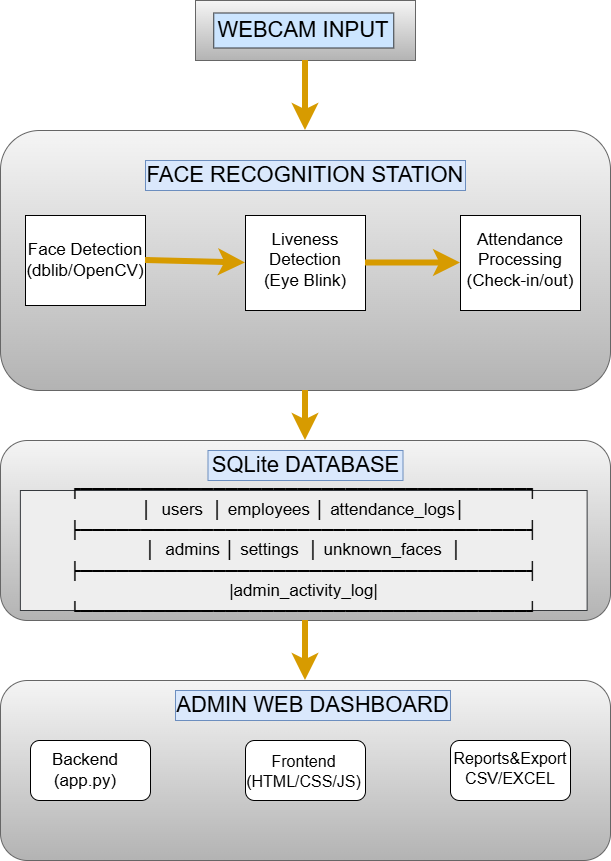

---

## 🎬 Recognition Flow

What happens every time a face appears in front of the camera:

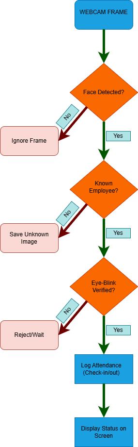

---

## 🖼️ Screenshots

### 🔐 Login
The entry point to the admin dashboard — clean, minimal, secure.

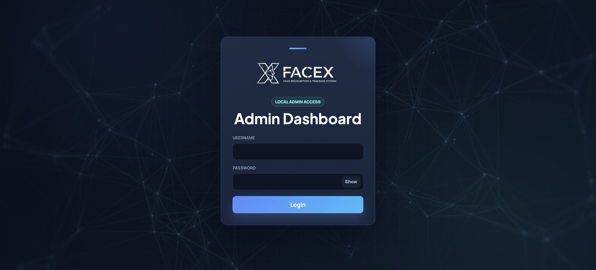

---

### 📊 Dashboard
At a glance: how many employees are present, who's late, and the latest check-in events. Absent employees are listed on the right.

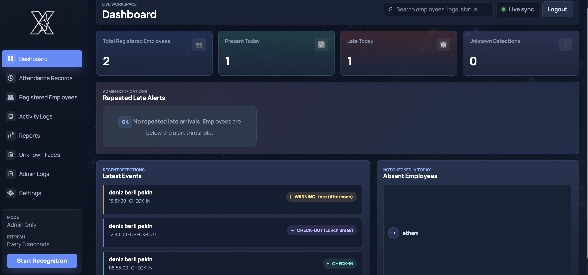

---

### 📋 Attendance Records
Full attendance log with entry/exit times, duration, and status. Export to CSV or Excel directly from this view.

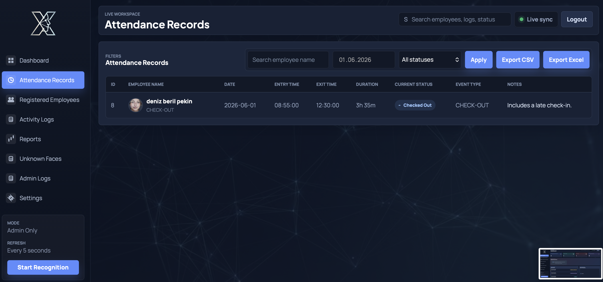

---

### 📝 Activity Logs
A timeline of every check-in and check-out event with status badges — on time, late warning, lunch break.

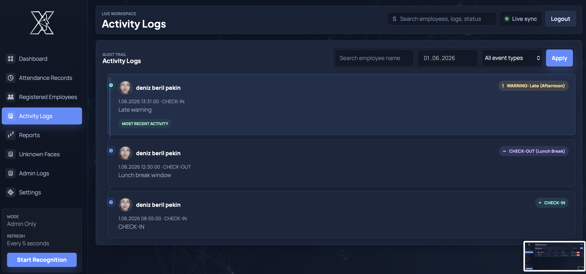

---

### 📤 Reports
Summary stats and one-click export buttons for daily, weekly, monthly, late arrival, and absent employee reports.

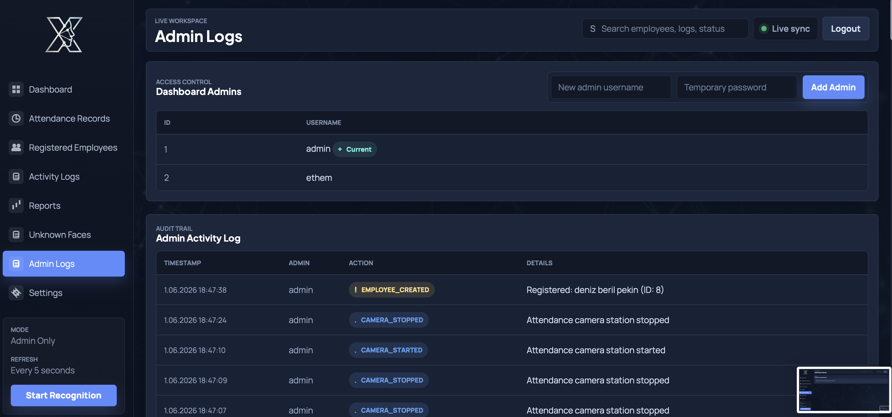

---

### ➕ Register New Employee
Register via live webcam capture or photo upload. Face encoding is generated and stored automatically.

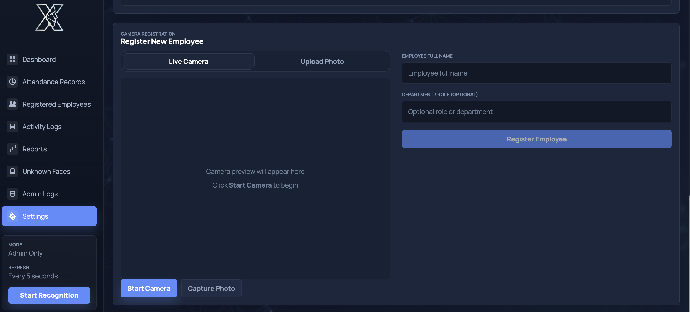

---

### ⚙️ Settings
Configure the live attendance camera and view real-time recognition worker status — camera index, check-out window, re-entry cooldown, liveness mode.

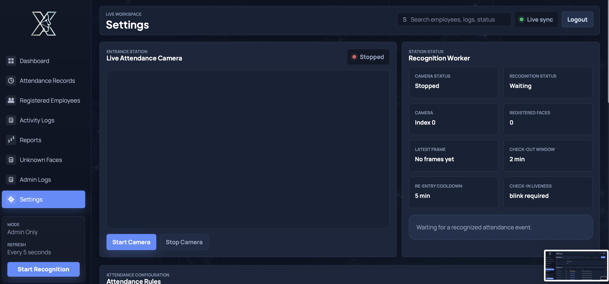

---

### 🔑 Admin Logs
Full audit trail of every admin action: who did what and when. Add new admins directly from this panel.

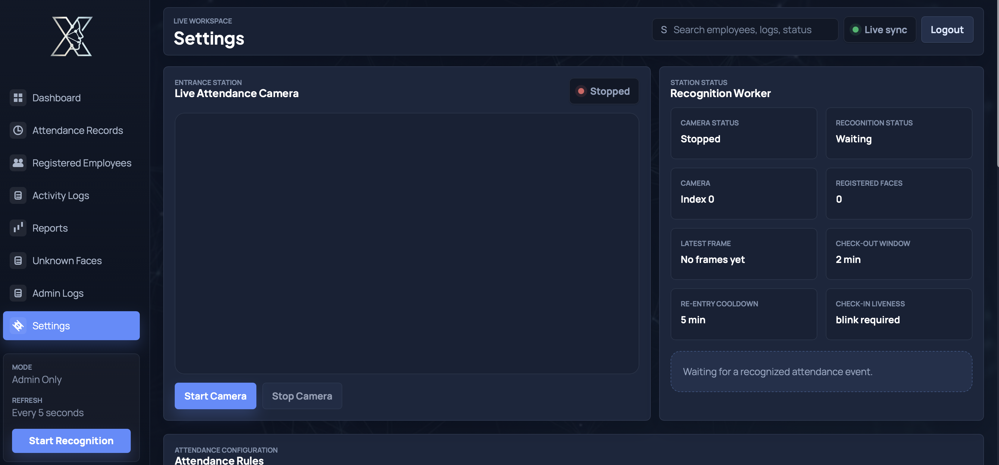

---

### 👥 Registered Employees
Employee directory with face registration status, last seen timestamp, and current attendance status.

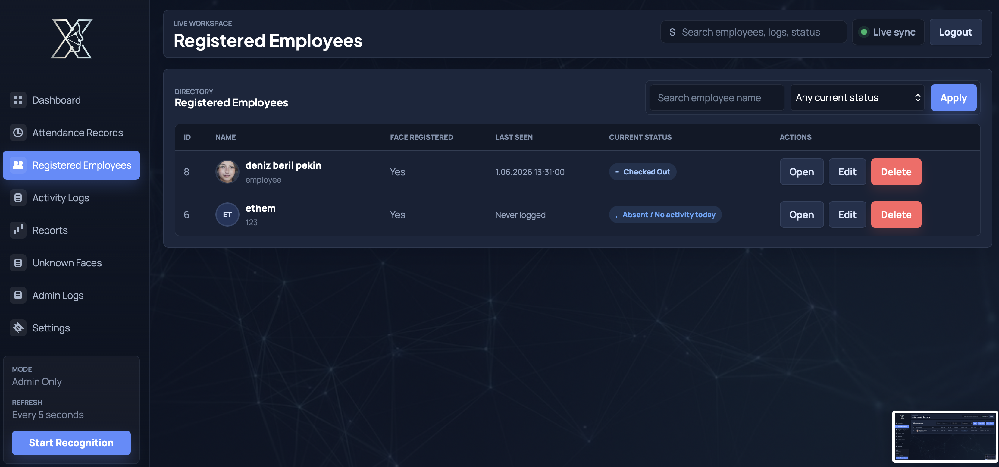

---

## 🛠️ Tech Stack

| Layer | Technology | Why |
|---|---|---|
| Language | Python 3.10+ | Core runtime |
| Face Recognition | face_recognition + dlib | Best-in-class accuracy |
| Computer Vision | OpenCV | Webcam capture & frame processing |
| Landmark Detection | dlib 68-point model | Eye-blink liveness |
| Database | SQLite | Zero-config, local, fast |
| Reporting | openpyxl | Excel export |
| Frontend | HTML5 + CSS3 + JS | Lightweight dashboard |
| Testing | pytest + coverage.py | Full business logic coverage |

---

## 📁 Project Structure

```
Face-Recognation-Based-Tracking-System/
│
├── main_recognition.py          # Entry point — webcam loop & recognition
├── attendance_station.py        # Live camera monitoring station
├── database_utils.py            # All DB operations (CRUD, migrations)
├── liveness_utils.py            # Eye-blink & sharpness detection
├── time_override.py             # Demo time simulation
├── delete_record.py             # Remove employee records
│
├── face_records.db              # SQLite database (auto-created)
├── attendance_logs.txt          # Flat-file backup log
├── shape_predictor_68_face_landmarks.dat
│
├── employee_images/             # Registered employee reference photos
├── unknown_face_images/         # Captured unknown face snapshots
│
├── web-dashboard/
│   ├── run_dashboard.py
│   ├── backend/
│   │   ├── app.py               # HTTP routes & API
│   │   └── data_access.py       # Dashboard DB queries
│   └── frontend/
│       ├── index.html
│       ├── login.html
│       ├── app.js
│       └── styles.css
│
├── docs/
│   ├── SystemArchitecture.png
│   ├── RecognitionFlow.png
│   └── screenshots/
│
└── tests/
    ├── conftest.py
    ├── test_database_utils.py
    ├── test_auth_and_registration_logic.py
    └── test_time_and_attendance_logic.py
```

---

## 🚀 Installation

### Prerequisites

- Python 3.10+
- A webcam
- Windows: [Visual Studio C++ Build Tools](https://visualstudio.microsoft.com/visual-cpp-build-tools/) (required for dlib)

### Step 1 — Clone

```bash
git clone https://github.com/EthemKesim/Face-Recognation-Based-Tracking-System.git
cd Face-Recognation-Based-Tracking-System
```

### Step 2 — Virtual Environment

```bash
# Windows
python -m venv venv
venv\Scripts\activate

# macOS / Linux
python3 -m venv venv
source venv/bin/activate
```

### Step 3 — Install Dependencies

```bash
pip install opencv-python face-recognition dlib numpy openpyxl pytest
```

> If `dlib` fails on Windows:
> ```bash
> pip install cmake
> pip install dlib
> ```

### Step 4 — Landmark Model

Download and place in project root:

```
shape_predictor_68_face_landmarks.dat
```

📥 [dlib.net/files/shape_predictor_68_face_landmarks.dat.bz2](http://dlib.net/files/shape_predictor_68_face_landmarks.dat.bz2)

---

## 🎬 Usage

### Start the Recognition System

```bash
python main_recognition.py
```

| Key | Action |
|---|---|
| `S` | Register a new employee |
| `Q` | Quit |

---

## 🖥️ Admin Dashboard

### Setup

Create `web-dashboard/.env`:

```env
ADMIN_USERNAME=admin
ADMIN_PASSWORD=your-secure-password
SESSION_SECRET=your-random-secret-key
```

### Start

```bash
cd web-dashboard
python run_dashboard.py
```

Open: `http://127.0.0.1:8000`

---

## ⏰ Attendance Rules

| Time | Status |
|---|---|
| Before 09:15 | ✅ On Time |
| 09:15 – 09:30 | ⚠️ Late Warning |
| After 09:30 | ❌ Late Violation |
| 12:00 – 13:15 | 🍽️ Lunch Break |
| 13:15 – 13:30 | ✅ On Time (Afternoon) |
| 13:30 – 13:45 | ⚠️ Late Warning (Afternoon) |
| After 13:45 | ❌ Late Violation (Afternoon) |
| After 18:00 | 🌙 After-Hours |

All thresholds are configurable from the Settings panel.

---

## 🗄️ Database Schema

| Table | Purpose |
|---|---|
| `users` | Face encodings |
| `employees` | Profiles and metadata |
| `attendance_logs` | Full check-in/out history |
| `admins` | Dashboard accounts (hashed passwords) |
| `settings` | Attendance rule configuration |
| `unknown_faces` | Unregistered face detections |
| `admin_activity_log` | Admin audit trail |

---

## 🧪 Testing

```bash
pytest
pytest --cov=. --cov-report=term-missing
```

| File | Covers |
|---|---|
| `test_database_utils.py` | DB init, migrations, CRUD |
| `test_auth_and_registration_logic.py` | Login, hashing, registration |
| `test_time_and_attendance_logic.py` | Check-in rules, time overrides |

---

## 🔐 Security

- Passwords hashed — never stored in plain text
- Session-based authentication for dashboard access
- Eye-blink liveness — photo spoofing blocked
- Image sharpness check — screen replay blocked
- Every admin action logged with timestamp
- Unknown faces flagged and stored for review

---

## 🗺️ What's Next

- [ ] Multi-camera support
- [ ] Cloud database (PostgreSQL / Firebase)
- [ ] Email & Slack notifications for late arrivals
- [ ] Mobile app
- [ ] Role-based access control
- [ ] 3D depth-based anti-spoofing
- [ ] Real-time analytics charts
- [ ] Docker support

---

## 🤝 Contributing

```bash
git checkout -b feature/your-feature
git commit -m "feat: describe your change"
git push origin feature/your-feature
# open a Pull Request
```

All tests must pass. New features need new tests.

---

## 👥 Authors

Built with care by four people who wanted attendance to be invisible:

- **Deniz Beril Pekin**
- **Ethem Kesim** — [@EthemKesim](https://github.com/EthemKesim)
- **Emre Çubuk**
- **Ozan Umut Güney**

---

<div align="center">

*built with obsession, tested with patience, deployed with a blink*

</div>
